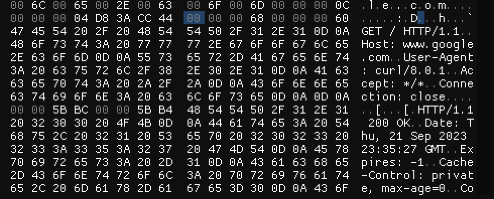

It’s been a while since I’ve done any web app testing. A long while. Last time I used [Burp](https://portswigger.net/burp/pro), there was no such thing as project files. There was a state file, which was some strange psuedo-xml file format but the new project files look like they contain more information. A _lot_ more information. So I’ve decided to have a prod and see whether I can extract any useful information from them.

## Basics
The first thing I tried was to run `file` against them:
```
❯ file example.burp
example.burp: data
```
So nothing useful there. Next I ran `strings `over the file:
```http
❯ strings example.burp  | head -n 20
`7SfK
`GET / HTTP/1.1
Host: www.google.com
User-Agent: curl/8.0.1
Accept: */*
Connection: close
HTTP/1.1 200 OK
Date: Thu, 21 Sep 2023 23:35:27 GMT
Expires: -1
Cache-Control: private, max-age=0
Content-Type: text/html; charset=ISO-8859-1
Content-Security-Policy-Report-Only: object-src 'none';base-uri 'self';script-src 'nonce-GR1bIaI-EiM_GHoaKQqG9A' 'strict-dynamic' 'report-sample' 'unsafe-eval' 'unsafe-inline' https: http:;report-uri https://csp.withgoogle.com/csp/gws/other-hp
Server: gws
X-XSS-Protection: 0
X-Frame-Options: SAMEORIGIN
Set-Cookie: AEC=Ad49MVERElAY4GlHAV1PF4GC-DfS1VpHQoo9l9-4TlLCht6J5T2Q_hwqV9Q; expires=Tue, 19-Mar-2024 23:35:27 GMT; path=/; domain=.google.com; Secure; HttpOnly; SameSite=lax
Accept-Ranges: none
Vary: Accept-Encoding
Connection: close
Content-Length: 22757
```
So obviously there’s some content to be found in there, so time to have a peek inside. My goto hex editor is normally [HxD](https://mh-nexus.de/en/hxd/#features) on Windows but after some Googling I thought I’d give [ImHex](https://imhex.werwolv.net) a go.

## Request Hunting
Opening the file and searching for our request to Google finds the following:


Here we can see the request, which is then followed by the response. Looking at the bytes prior to the string `GET`, we see:
```
00 00 00 68 00 00 00 60
```
The two four-byte values are 104 and 96 in decimal, and 96 just happens to be the length of the request. Similarly, the eight bytes after the request are:
```
00 00 5B BC 00 00 5B B4
```
And `5B B4` is 23,476, which is the length of the response. So we have the requests and responses next to each other, and a way to know how much to read from the file.

My next idea is to see whether there are any pointers to these locations within the file. 